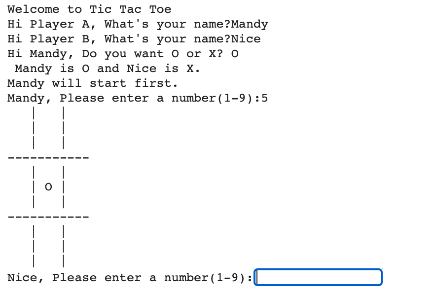

# Some Python mini-project

### 1. **Web Scraping and Visualization on HK Job Market:**
Getting data from RECRUIT HK & CTGOODJOBS for industry analysis
* [View more details](./WebScraping-JobMarketTrend)
* [View code](./WebScraping-JobMarketTrend/recruit-hk-analysis.ipynb)

<h5>Remarks: This is a group project of 3</h5>
   
### 2. **Tic Tac Toe:**
Tic tac toe game for 2 players.
   * [View code](./TicTacToe/Tic_Tac_Toe.ipynb)
   
