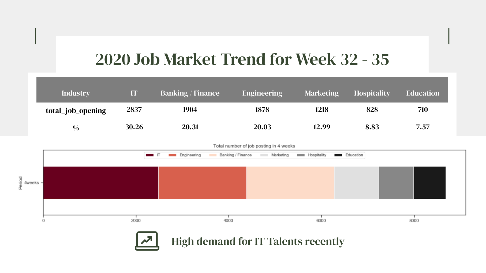
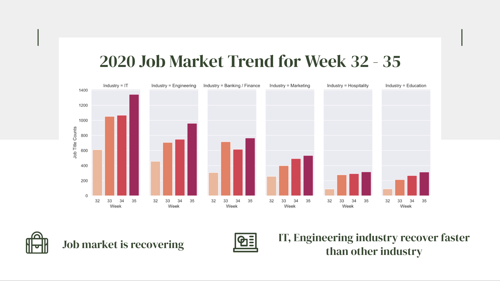

# Job Market Trend Analysis

<header>
<h2>WEB SCRAPING: RECRUIT HK, CTGOODJOBS</h2>
</header>
<section>
<!-- <header>

Details

</header> -->

	<ul>
	<li><strong>BUSINESS VALUES: </strong></li>
	<li>- With IT getting more paramount in modern days, this report is to provide some insights on trend of recovery in the job market. </li>
	<li>- To unveil the rising demand for  IT experts and understand the job package for IT talents in various industries so to create more opportunities for digital-based institutions.</li>
	</ul>

<ul>
	<li><strong>DATA COLLECTION:</strong></li>
	<li>- Using Selenium for web scraping on two local recruitment websites: Recruit HK and CTgoodjobs.</li>
	<li>- Industry Covered: Banking / Finance, Education, Engineering, Hospitality, IT, Marketing</li>
	<li>Date Period: Aug 10 - Sept 5  (Week 32 - Week 35)</li>
	<li>- Remove all duplicates: 9375 rows of records</li>
	<li>- Remove weekly duplicates: 12902 rows of records</li>
</ul>

<strong>MARKET TREND:</strong>
 
We can see that there are high demand for IT talents comparing to other industries. During the period of pandemic, the job opening is increasing week by week.
 

 

 

